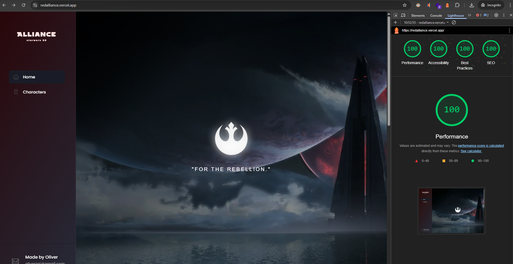

## Next.js + TypeScript Application
**Starwars inspired app that serves as catalog for starwars characters**


- Lighthouse:
- Performance 100
- Accessibility 100
- Best Practices 100
- SEO 100



Deployed at: https://redalliance.vercel.app/

Features:

- Responsiveness (PC, table, phone with toggleable sidebar)
- PWA
- SEO
- Filtering (since there isnt much data coming, it's more optimal to handle filtering and pagination on FE side)
- Accessibility (tabbing, aria labels)
- Some animations
- Lazy loading/Dynamic imports
- Github
- CI/CD with Vercel
- Eslint, Prettier, Husky - Precommit hooks
- Testing - with React Testing Library and Jest
- Abstracted API Layer

Ideas for future:

- Convert styles to use Tailwind CSS
- Pokemon style cards
- Authentication
- Light / Dark themes
- "Glass-like" style of cards
- Add more sections
- Add more data, since its a DB style app

## Getting Started

First, run the development server:

```bash
npm run dev
# or
yarn dev
```

Open [http://localhost:3000](http://localhost:3000) with your browser to see the result.

You can start editing the page by modifying `pages/index.js`. The page auto-updates as you edit the file.

[API routes](https://nextjs.org/docs/api-routes/introduction) can be accessed on [http://localhost:3000/api/hello](http://localhost:3000/api/hello). This endpoint can be edited in `pages/api/hello.js`.

The `pages/api` directory is mapped to `/api/*`. Files in this directory are treated as [API routes](https://nextjs.org/docs/api-routes/introduction) instead of React pages.

## Learn More

To learn more about Next.js, take a look at the following resources:

- [Next.js Documentation](https://nextjs.org/docs) - learn about Next.js features and API.
- [Learn Next.js](https://nextjs.org/learn) - an interactive Next.js tutorial.

You can check out [the Next.js GitHub repository](https://github.com/vercel/next.js/) - your feedback and contributions are welcome!

## Deploy on Vercel

The easiest way to deploy your Next.js app is to use the [Vercel Platform](https://vercel.com/new?utm_medium=default-template&filter=next.js&utm_source=create-next-app&utm_campaign=create-next-app-readme) from the creators of Next.js.

Check out our [Next.js deployment documentation](https://nextjs.org/docs/deployment) for more details.
